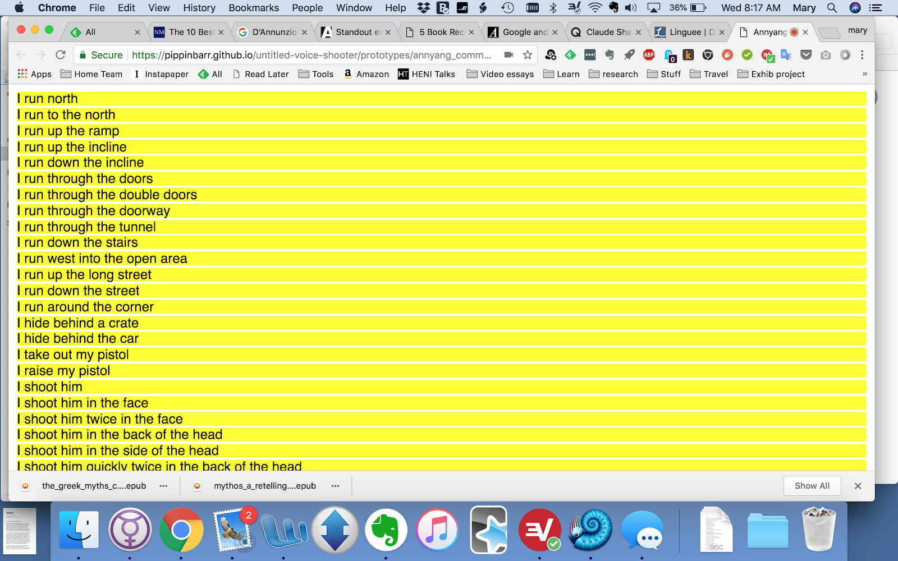

# Tuesday, 3 July 2018, 12:22PM

I'm on a plane from Montréal to LA right now, en route to Hawai‘i. I started writing in my notebook but given that this is, I think, a text-only project it doesn't make a lot of sense? Or at least that's what I felt at the time. Here are a couple of notes, then, while I'm thinking about it.

- A text only game where you act by speaking your action.
- The research question/idea here is that I want to make something violent and confronting in a way that might actually register with a player. Could call it a spiritual successor to A Series of Gunshots obviously. But in this case I want to try having it register because you are _saying what you do out loud_, I think tonally probably in language that is fairly neutral, more about reporting what you do and I think reporting what happens, speaking that too.
- By turning that speaking of the text into the underlying 'mechanic' of the game the player can't avoid it and even _wants_ to speak these texts aloud, but then hopefully also can't avoid the grossness of the violence being both enacted and depicted  by them? It's like telling a story where you're a horrible person and acting it out, but also actually 'doing it', making the decisions, and so on.
- There need to be _choices_ you're making to pull it closer to a standard FPS kind of situation, whether they're just tactical/spatial or whether they're part of a narrative I don't know?
- Does it need further game-ish levels to have people actually work through it? Time limits? Do I run a risk of getting into voice recognition hell if I do that?
- Seems important that any narrative framing adheres to the flimsy shit that most FPSes do? Or will that still work out such that people don't give a shit? If I make it something more obviously problematic (e.g. not war but something like shooting criminals?) will the problematic nature of that violence manage to bite _me_ in the ass when I'm trying to bite _it_ in the ass? Like an ouroboros of ass-biting?
- If it has more game-like mechanics people will get more into it and probably that's not what I want? As with A Series of Gunshots, it seems like a key thing the voice controls would do is provide _both_ distance (it's text, it isn't real-time) and closeness (it's your voice, it's in the first person, it can be very specific).
- So is this thing like, a Twine that you navigate by voice and that's about it? In which case I can very obviously prototype in twine to move a bit faster?
- Or is this thing, like, an actual game with an underlying model of enemies and things happening in the space (albeit turn-based I suppose, or tick based or some kind)?
- There are merits to both those approaches? The Twine approach is blatantly appealing because it's easy and I can visualise how I'd get the code done (just JSON or whatever for the data of the game + annyang = the game), so the main challenge involved would be working out the UI, which bits you speak, how you make choices, and the writing of the texts themselves...
- The 'real game' approach is interesting because it more accurately replicates the kind of system I'm trying to comment on/deal with, it wouldn't be a canned story, it would have 'replay value' which is intriguing in itself... that idea of sort of playing into the existing ecosystem/tropes of the genre seem like they could be interesting. But I risk it becoming too fun or too distancing because it uses those same techniques? It would need procedural text generating business in order to be replayable... you'd have a set of characters in a space, they would move around, there would be rules around them killing you or you killing them... it would actually be pretty interesting, but maybe overkill for what I'm trying to do with the underlying idea? I'm not trying to make an interesting game on that front.
- So perhaps part of an answer here is that it _would_ be interesting to make some kind of text-only Twine-ish action game or sport game? (Kicker 2?) Maybe even with voice-to-text. BUT in this specific instance what I need is probably more like a canned (but still multipath) Twine that brings you into that situation. And the multipath thing gives you some replay in there anyway, so it's not like it'd be linear (which would be unacceptable).
- It definitely occurs to me that Counter-Strike could be quite a good model for this. It's well known, you could even frame it in dust or dust2 or something and make those elements kind of apparent as well (I could do some writing for the podcast that focuses around, say, the maps to get some practice in). This would mean having a team which is interesting too. There are clear and interesting branches to do with spaces as well which is interesting, choosing who to follow. I think you should clearly be a 'good guy' right? Should you? Will I run into a too powerful narrative of righteousness?
- On the other hand, it's still pretty gross isn't it? And the point isn't that VIOLENCE is gross (though, I mean, hey) but rather than VIDEOGAME VIOLENCE is gross, that the justifying narrative is also gross, that the actions you commonly take in a videogame, recontextualised to your voice, are horrible and not good things to be doing with yourself?
- I mean, that's all sounding pretty self-righteous and I'll have to watch my goddamn tone and so on, but I think that's an important distinction just in terms of layers of narrative and intent.
- If I wanted epic extra work I could have the first choice be to say "I am a terrorist" or "I am a counter-terrorist".
- Maybe there's a niceness in here to having the choice, then you speak it, then the follow-on text fills in? There are definite UI businesses to think through here, not just text.
- I'm concerned that with something like Counter-Strike or similar there's such a mechanicsiness at so many levels (switching weapons, jumping, buying weapons, crouching, sprinting, walking) and so on... there are so many things you expect to be able to do, I suppose, _at any time_, which doesn't fit so well? But I think moments of design-worry like this are where I need to step back and say: this is a Twine. It's not THE GAME ITSELF, it's the reporting of the game with agency.

Titles?

- First Person Shooter (hell on search engines)
- Shooting in the First Person (kind of a mouthful)
- Should it even be named after its supposed 'genre' or something more general?
- "I shoot him in the face"

Basic mechanics

- I mean, as above, the base level structure is
  - Game presents you with a choice OR perhaps some kind of internal Twine expansion thing too, which I like (looking at some detail)
  - You speak your choice ("the pool of blood", "I switch to my sidearm")
  - New text arrives, possibly that you then also have to speak, and which is then complemented with further text? So like "I shoot the man on the left" goes to a new page which leads with text you speak "He goes down in a heap, blood leaking from his face." and then further text fills in further details and context?

- Looking at that structure I suppose you (the player) narrate your precise action plus its IMMEDIATE consequences and the game then adds on further consequences/context that lead to your next decision.

First steps

- Seems like I need to decide on the narrative frame (Counter-Strike in the early lead)
- Need to decide on basic structure of a page or pages of the text (decision, extra narrated text, context, other forms of decision that are less decisive, questions of state and state tracking, how bushy is the tree?)
- Then I need to jump into Twine and start modeling out a simple scenario from the game (an encounter with a terrorist at the double doors, say)
- Then once modeled I build it in jQuery with annyang! and see how it feels as an experience and make adjustments as needed
- Then I write the whole thing presumably
- Win an Oscar and a Grammy and a Tony and the other one... an Emmy.
- Nobel not long after that
- I die without regrets at a ripe old age

1500 words of process writing on a plane. Suck it. Suck it.

---

# Tuesday, 14 August 2018, 11:01AM

I'm clambering back in the saddle after four weeks in Hawai‘i helping to run the SKINS 6.0 workshop and then another part of a week in Malmö where I gave a talk about MDMA (the design documentation method obviously) at FDG 2018. Meta.

I had a couple of other ideas for games while I was travelling, but I'm kind of assuming that the voice shooter is the right game to carry on with right now.

Rereading the first entry right now, I've already done quite a substantial amount of the up front thinking for this thing. Reading it makes me think I need to create my [Research Statement](Research-Statement.md) page right about now so that I can start tracking what I think this project is about in a separate space.

It seems like the big thing to do right now is to model a basic unit of meaning in the game and then build that in a Twine as discussed above. I guess that'll mean having a separate prototypes folder in the repo where I can put things that aren't the final codebase of the game separately from it. Twine does make a lot of sense since I think it has a huge amount of the features I want from this, with the exception of being able to choose options with voice instead of the mouse.

It's plausible I could mod Twine with a plugin of some kind to just integrate annyang per page... it would need to scan the page for links/commands, add them to annyang, trigger the click, and so on. A per-page processing thing I suppose. Wonder how hard that would actually be...?

But the outcome would be Twine code that would confuse the shit out of me to work with and I'd be fighting a whole bunch of aesthetic stuff I don't think I want to fight in terms of Twine's CSS. I think this project is simple enough to just proceed with my own primitive abilities...

But that said it could be worth, at some point, investigating writing that plugin for Twine because I feel like it might be of use to people other than me. I see there is such a thing for Alexa already, but who has an Alexa? Not me. Well TAG does, but who else has one? Millions I suppose, but whatchagonnado? Is Amazon going to be into a violent first person experience on that hardware? No sir.

Okay ANYWAY.

To do:
- Write a first [Research Statement](Research-Statement.md)
- Write a sketchy example of a sequence of screens that could be Twined. For now just write them in here in another entry.

I note that I have tacitly, at least for now, decided to use CS:GO on dust2 as my framing.

---

# Thursday, 16 August 2018, 7:16AM

As I sat down to write a Twine example I ran into a couple of things

- Fear of bad writing and the blank page, a classic
- Spinning on questions around how the game will be implemented - notably the question of whether a 'passage' represents a place or a beat in time, two very different things

A beat in time would be more Twine-y and more straightforwardly amenable to 'just' telling a branching story. A place would be more in line with some level of simulation underneath the game.

As I've already discussed (but clearly am going to have to return to a couple of times to figure out), having a simulation layer underneath the game might be a bit of overkill. It's not straightforwardly related to the task a hand (getting people to say they're doing things), it'll take a fair bit of code and, most centrally, some language generation stuff that's reactive to situations. It might also open the door to a feeling of complaint/annoyance that it doesn't simulate _more_ than it does.

The problem with the more standard narrative approach is probably mostly that it's something I don't have much practice with... words are hard won, narrative structure and thinking about branching are hard won.

There's also the factor, I think, of 'emulating' a real-time game that does simulate in a link-based static hypertext. There's an awkwardness of translation there that runs very deep and at some level feels like it's 'wrong' to do it? Which is interesting. I also hadn't really thought about this as another form of _translation_ until now, so that's a helpful insight.

## What if simulation?

Just as a what if to clear my mind of it, what would the simulation version have?

- You could avoid weapon switching by making it the first round of the game and so only pistol (and technically knife)
- You'd have to be able to navigate space at some level of granularity (could be at the level of doorways and spaces, could be at the level of taking cover)
- You'd have to be able to shoot at enemies and have resulting hits/misses (this is where the key descriptive stuff would have to come in and would have to be generated)
- Might need to track ammo, but maybe not, could be abstracted away
- You'd potentially need to be able to be shot yourself, which would introduce radically different dynamics to the game, the ability to die which would end the game.
- You'd need to be able to track other agents through the space, both teammates and terrorists - each link selection they would also select spaces to move into. This could potentially be a canned sequence though now I think about it? They would all just go along particular paths, ideally in such a way as you would not share the space with your team? No that wouldn't be plausible.

Problems/unnaturalnesses
- The movement dynamics would always be a poor fit - movement in a game like CS is creative and reactive, using the available space, can't be dumbed down into just entering a room and shooting someone
- Space could lead to just not being able to FIND the enemy, just like in the real thing, which could be pretty lame and anticlimactic.
- Obviously this would be hard to do

## What if narrative?

The counter-point is a canned narrative structure you follow through with your voice, exploring the environment (by looking at things Twine style, perhaps even performing canned actions like taking cover?).

Could arrange the whole thing by spaces, and different spaces would be assigned enemies in them who are just always there, always running in from some door (or some random door that isn't the one you came in through). Or there could be the minimal kind of "instance" chance of an enemy come into any space while you're there.

Perhaps your team has already run off and are actually all dead in some location? That explains them not being active in the game. Maybe four of them are dead, two terrorists are already dead, and you have three to kill yourself.

- Bomb never gets planted?
- How to deal with a potential sidelining of the violent language if you're exploring space and not encountering people? Well, we can force encounters if we use the "instancing system" above... and it can get more and more likely. The game could be quite short, just you move through a couple of spaces at most, then hit enemies in each remaining and kill them.

- Can you be killed or does the enemy miss?
- Do you ever miss? No I don't think so, but it's plausible you could hit and wound rather than kill in one shot... but could also compress multiple shots into one action that kills. If every time you attacked you killed it would be kind of helpful in terms of not complicating the model of what should happen next.

## More general

Don't forget this is an experiment not the next most amazing game anyone ever made. Don't fall too in love with how you think it could work/be, focus on the idea you're exploring and just explore it.

## Some brass tacks

I think the instancing mode is a nice compromise in terms of mapping out how the game can be a little bit dynamic without being too dynamic.

Therefore:
- the passages in the hypertext would be places you would move between, plausibly reflective of the designated CS spaces if I wanted to be cute and insider-y
- default actions in a space are
  - _move_: take one of its exits (a door, a ramp, some stairs, etc. to move to a new space)
  - _shoot_: if there's an enemy you can always attack them (knife?) and kill them (for now let's assume you always kill)
  - _examine?_: maybe you can examine certain things more closely (corpses would be an obvious one, maybe some other details for fun? or will that distract?)
  - _take cover?_: kind of pointless and seems like it creates way more work? but could have more of a sense of agency. Big question: how much does agency even matter?
- in any given place there's a chance of a terrorist being there or arriving there (same thing with different description), which activates the ability to shoot that terrorist (though you can also leave). First approximation it's just a random chance that becomes more likely over time so that you eventually definitely see them all (and kill them all unless you choose to run away - maybe they have super high chance to follow). (I think the terrorists should be 'individuals' so that there's some attention paid to who you're killing visually, not just a symbol of terrorist.)
- The bomb is never planted? They just never get around to it? Maybe the bomb is on the ground in that initial firefight and the terrorists just don't pick it up?
- Should be possible for a terrorist to arrive while you're in a scene (e.g. if you're there and you examine something - if that's a thing - then in that moment a terrorist could arrive and you could shoot them etc.)
- I guess you should have access to the various exits even when you're looking at something else? And you should be able to look back at the scene? Already getting complex by allowing you to examine things... could use text expansion instead of a new scene?

OKAY. Well I think we clarified a few things with this which is good. The whole game is pretty prototypeable in Twine other than the dynamic elements of instancing terrorists, so I should be able to try this 'feel' out without risking a whole lot of dev time.

So the next task is, I think, to write the story up to the first terrorist instance?

(It occurs to me, just briefly, that this could bear some relationship/reference to something like Brawl in Cellblock 99 or even Bone Tomahawk... the idea of violence as slowed and more inevitable. In fact that kind of weird magical inevitability could be a tone and rationale for you never missing and the terrorists always missing... you're just a destructive force... which fits the experience I'm interested in.)

(Could someone make the argument that the consequentiality/nature of the violence is diminished when you yourself are not under threat from anything? Should it feel like you are? If you can be killed, what does that mean for me? I guess it would actually be okay... sometimes you take a hit, maybe very occasionally you miss? That doesn't seem terrible.)

Okay so let's say for now that you can also dynamically _die_ as well.

A lot of words as always, but I think we got somewhere with this. I don't think it was just Twine avoidance.

To do:
- Wait, maybe the only to do here is to start my [Task List](Task-List.md).

---

# Monday, 20 August 2018, 7:27AM

I'm in the process of trying to write that Twine and noticed:

- Twine (to me) feels like it leans toward the second person, so I immediately started the first passage with "You...". I guess that somehow comes from the CYOA roots or something? Or just the Twines I've played all tend to do that? At any rate, I was doing it without thinking, but in fact when I do think about it I feel like that's maybe not good for this game? If the idea is to lean toward neutrality and factuality then "you" is problematic because it invites suggesting more than just facts to the player, more about perception and affect and so on. It's also tricky (perhaps) when I treat each passage as a space? "You" might experience different spaces differently depending on what has happened, where you're going. So all told I'd like to find a way to write the space in pure description.

- In an act of mild busywork I was rearranging the passages in the visual map of the story and realised it's probably possible to actually position them realistically in terms of the actual map which is a nice thing to think about.

- While writing the various areas it's more apparent that it's not _so_ hard to write them if only because you don't want vast amounts of description. I like the fact that the descriptions can stay identical in the same way the places themselves stay identical in the game (nothing moves or changes ever right?). It's tempting to therefore reproduce every specified location in CS:GO. However, I wonder whether the projects starts to move too far toward a) a tribute to CS:GO which starts to get kind of winky in the wrong way, and b) requiring/seeming to need more dynamic elements that CS:GO has like, say, weapon switching and player death and so on, which could easily be distractions from what I think this is about.

- Was worried about how the game is kind of ballooning away from the core interaction of reading out a description of what you do to someone else, but while I've been writing I think that maybe the delay on that is not such a terrible thing. You get used to the idea of describing your actions for innocuous movement through space, and then end up having to use that same "action" of speech to describe (hopefully) terrible things.

- As I write this I wonder how hard a more dynamic version of the game would be? I think random instancing still makes 100% sense because I don't think you'd be able to tell from the outside what is going on with an "AI" (and you could even have terrorists occasionally randomly leave an area for example, and then just not be there when you follow). The potential risk of course is that if I turn it into a situation where the player can die and so on, then does it detune the violence of their actions? In a sense it's a better test of this though - my argument isn't about creating a restricted vision of the game so much as recontextualising the mechanics into speech? In which case I "should" do the more dynamic thing? Which I believe I can (I believe in me). So I'll contemplate that.

For now, I've written the prototype up to the first terrorist encounter and have run into plenty of things to think about, so a very good hour of work has been done on this I think. I'm committing the Twine itself to the root of the repo while I work on this so it's playable as part of the build.

---

# Monday, 20 August 2018, 17:34PM

In some more time today I managed to script a version of the terrorist encounter based on link-reveal hooks in Twine with the idea being that you kind of speak the entire encounter, line by line. There might be something powerful to it, a kind of slam poetry of killing?

There's a really obvious thing to do, which is to test the material I have by doing a read-through of playing, but I'm not in the head space to do it right now - that's on the cards for tomorrow.

Implementing the basic killing of the terrorist immediately pointed out that you then have to update the scene you killed the terrorist in to include his body. When these things become dynamic I have to think about what to do about the idea of multiple terrorists spawning in one location and being killed.

An obvious solution to that is that each place has a _canned_ terrorist encounter (possibly with randomised elements with tracery-like writing) which can be triggered. This would mean only one terrorist body per scene, which might seem a little weird since terrorists often come in bunches in the game, given they're working together? Should each scene have a two-terrorist and a one-terrorist sequence? It seems really convoluted and irritating to do it that way. The alternative is to be much more dynamic with encounters and to save much more into state variables (like actual description texts for example) when you actually kill a terrorist. And then have the passage involving a terrorist being present being kind of a separate generation thing? (But there's a weird place specific-ness to the action itself that might make this difficult... where you are changes the way you might kill a terrorist?)

There are still questions about how to do this, and that's something to keep in mind on my next pass at the Twine. How are these instantiations of combat actually going to function given that you need to then maintain state for the terrorist(s) killed in a location, potentially including the idea they might be shot near a specific entrance they came in from? (Need to think, even, about line of sight and the idea that a terrorist can't just be standing there when you approach from a place that has visibility to that next location... they could only be entering? Or is that getting way too involved?)

Anyway, I think this has jumped a long way today with the Twine. Go prototyping, go.

---

# Tuesday, 21 August 2018, 7:31AM

Thoughts while reading through the Twine and also voicing some commands to annyang...

- I wonder if some small amount of realtime-ness could work with some texts/events that are cued on a delay (with some indication of what's happening)... something I've done in Twine before, so could simulate this too. There's an oddity to just standing there with the terrorist, gun leveled, until you do something. On the other hand, adding time pressure may well end up in conflict with voice recognition... hmmm. Probably not worth it really, voice recognition is great much of the time and then suddenly terrible?

- When I was "properly" playing it became apparent that some of the dynamics of the game need to be thought through. If you see a terrorist at the doors at Long Corner and then run down into Pit, then they are pretty obviously going to stick around and/or come and try to kill you. It's deeply unrealistic, I think, if you then run back out and they're just gone.

- Is it worth having a "wait" command? "I wait here for now." that would allow a tick to pass, a terrorist to arrive, etc.? There would be no actual tactical utility I suppose, but it might make sense in terms of how you deal with space?

- Waiting then begs the question of taking cover. But yikes, that's starting to get pretty painful to say the least, because if you can take cover you'd probably want to deal with the idea of probabilities of being hit by a bullet, or advantages of surprise attacks on terrorists who arrive in a scene but don't see you. I don't want to get _too_ lost in the actual dynamics of play, just enough that it feels like there's a game of CS being played, right?

- Should you be able to switch to the knife? If so how does that change your ability to to do things? Maybe there's a terrorist you can find unawares and you have the option of shooting them or knifing them by drawing your knife?

- What specifically am I worrying about with all these quibbles about staying true to the interactive/situational possibilities of CS:GO specifically? How does that interact with what this game is? The concern is that to the extent that this game diverges it'll be possible for a player to a) discount it as not "really" like the thing they play (not game-like enough for instance) and b) simply be bored by it as an experience. But is that a reasonable fear? It's not like a bunch of hard-core CS:GO players are going to play this thing, I'll be lucky if anyone gets past the frustrations of voice recognition? But I suppose there's a bigger argument about what it is about a game like CS:GO that (supposedly) makes the violence okay or less real or something? (But at that level, it _can't_ be that what makes it okay/less real is the complexity of the simulation, can it?)

- Things like "kill or be killed" are a clear rationale for violence. You're in a situation of war/counter-terrorism/whatever and therefore killing is right. People believe this in the real world too of course. It's important to have that as part of this game for that reason - I don't want people to be able to say the violence felt icky (if it does) because there was no way for the terrorists to fight back? I want the depiction of violence itself, detached from situational elements, to be the thing that disturbs. That's the thing we should question ourselves about - why am I enjoying this etc.

- It's quite hard to write all this stuff and not feel prudish, but I'm just wanting questions rather than offering answers here... after all, I've played plenty of CS:GO with bots for instance, and shot plenty of them, and I don't feel disturbed moment to moment, but more later on when I think about how I'm spending my time on violence - the fun of it doesn't feel like enough compensation for my soul or whatever.

- Returning to dynamic elements of playing CS:GO... what are they? I need to play some rounds with bots and pay attention to what elements of the world can actually change. To hazard a (pretty educated) guess:
  - Sound
    - Radio chatter from teammates about what is happening
    - Game announcements (go go go etc.)
    - Footsteps, gunshots, knife swings, jumping
  - New static objects (from death)
    - Corpses
    - blood
    - weapons and a bomb
    - Bullet holes?
    - (If grenades then scorch marks.)
  - Agents
    - People move through the environment and shoot their guns (jumping, sprinting, walking, crouching, shooting, knifing, bomb-planting)

- Pretty sure the environment is completely indestructible in CS:GO maps, so that's not a thing.

- What about a different interfacing approach in which a scene is just a description of the setting, and the spoken options are "I run...", "I shoot..." which, when you say them, give you the options... "I run..." -> "I run down the incline into the intersection.", "I shoot..." -> "I shoot him in the face.". With graceful exits like "I run to a new position in the space." (to stay put) and "I shoot a bullet into a wall." (to not shoot a terrorist, I guess). There's something nice about keeping it that blunt about what it is you can actually do? And it would keep the actual Twine passages much more simple-looking which is appealing. Harder to simulate in Twine because I'd need to create each screen in custom fashion, but "easier" when I'm writing my own code?

- That said, I think there's something more nicely literary and clear about the way it is now? These are all questions, to some extent, of how simulation-y I want to go, versus how Twine-y? I suspect my life is easier with the way it is now. I wonder if I can trim down the descriptive stuff by leaving the description of places you can go to the actual commands? The concern is always that the longer those are the more likely there's a voice-recognition error.

- Staring at the interface I wonder, too, whether it'd be nice/interesting to have it be a continuous page rather than separate displays, with additive text. When you speak an option it highlights, the others disappear, and the next thing appears below with auto scroll. (Should look at [Even Cowgirls Bleed](http://scoutshonour.com/cowgirl/) for UI specifics of this. I just looked at it bit, so I have some of that loaded into memory. In essence: on selecting an action the action disappears, new texts/links fade in, page scrolls as needed. Obviously I would want to remove the action text as that's central to how this works. Also need to think about the fact there are multiple actions here, some of which _should_ vanish when not selected, which creates spacing issues.)

---

# Friday, 24 August 2018, 7:32AM

I'm going to do the performance play-through now to take more notes.

- Funny how much the Twine-ness of this has taken charge of a lot of design considerations, despite the fact it's "meant to be" chiefly about the idea of voice recognition. I'm finding myself using many Twine-established conventions as a way to handle displaying a hypertext.

- Re-reading the previous entry I'm struck by how many ideas are explicitly noted and then argued against right away and then ultimately dropped from consideration, all in the same breathe. But also others which are more in tension. Makes me wonder if there should be another document somewhere with design ideas are more explicitly noted. They're not yet tasks because they're not decided, but if they stay "just" in this journal there's a good chance I won't see them again and therefore won't remember to think about them? This is an argument for a more formalised description of design I suppose? (Kind of hilarious if I eventually "discovered" design documents. Heh.)

Okay, on with the playthrough...

- Interesting question of how to indicate to the player "what they said". In cases where you don't get a match, how can they figure out what might be going wrong? Do I display their speech in a box at the bottom. If so, what does it do on success? Does the text fly onto the correct one (gross?), does it just go green or whatever? Do the options themselves vanish and the spoken text flies into position? (That might be nice? Can we guarantee they're looking at the options when they speak though? Not really.)

- Possibility of some level of statistical matching? Record what was said and do a diff against the options and allow it if it's pretty close? This would be weird if players were being subversive... "I don't shoot him in the face" matches "I shoot him in the face" say. But it would allow for imprecisions and recognition weirdnesses? That said, annyang seems pretty robust and I have the advantage of not asking theme to _make up_ what to say, only to select with their voice.

- The other "obvious" approach would be progressive highlighting of all options as words come in. That would look pretty sophisticated but I can imagine it would be pretty nightmarish to get right and probably not worth it overall

- Maybe the spoken text can be after a little angle bracket like a text adventure? That would be pretty clean design-wise. It would also allow the options to shrink away and then the angle bracket remains on the speech to indicate things you _said_. I think that's pretty reasonable.

- Maybe progressive fade-ins of paragraphs after issuing a command. Seems like it'll feel good.

- The _silence of the game itself_ maybe feels weird? As I'm sitting here speaking aloud the fact the game responds in complete silence is strange. But maybe that's a good eeriness? There's a bizarre-feeling disjunction between voice and Twine interaction somehow? Should we at least have, say, gunshot sounds? Or does that get kind of gimmicky? Especially if you include knife sounds. Starts to sound too much like a cheesy audiobook? I guess what we have here is a modal mismatch? Voice/audio in, text/visual out. Has an unnatural feeling. For now I'll choose to believe that's advantageous.

- It's very apparent in reading through that all the place descriptions are just sets of exits with perhaps one point of interest? I think it would likely be better to actually describe the location itself (shops, specific shapes, the sky, etc.) and leave exits to the commands?

- I'm realising with the "voice command becomes part of the text" idea that any kind of twine passage reveal thing isn't going to make sense because that stuff affects the inside of the passage (e.g. looking at the terrorist bodies), it would have to be a command at the bottom like "I look at the corpses" followed by a corpse-specific passage, leading to the problem of context - you lose the greater context? But perhaps you don't, perhaps after that it gives you the description, but re-presents all the options for the place and assumes you still know what it looks like?

- The way the Twine works now, when you shoot you end up on a new passage and there's something nice about the abruptness of that, the way it puts the act itself in its own bubble, shut off from the rest of the world. If I'm using the scrolling version it will look very different, each option progressively appearing at the bottom of the full text and therefore less "special" perhaps?

```
I am at a street corner.

The four bodies of the other counter-terrorist operatives
are strewn around the area alongside two terrorist corpses.
Blood spatters the dusty ground and walls and pistols litter
the area.

There is a sharp incline leading down toward a garage door
to the south, while the main street extends back to the north.
A large set of doors, one of them ajar, allow passage through
a building to the south-west.

A terrorist, bandanas masking his entire face, stands near
the doors, a pistol levelled at my head.

I aim my gun at the terrorist and pull the trigger.

I fire two quick shots.

Both hit him in the head.

Blood splashes against the wall behind him as he drops to the ground.

He lies motionless on his back, neutralised, head turned to one side.
```

- Looking at it, perhaps it's okay? It's less isolated, but it's also more integrated, more like a thing you really did? It won't vanish as soon as it's over?

- Performing the voice commands is weird because it doesn't feel like I'm doing anything. Next up I probably need to make a really specific and hacky prototype of the annyang sequence required to simulate the terrorist encounter. Maybe just the space before it, then the encounter itself, maybe even with some amount of the text effects if they seem easy, but otherwise just literally registering the commands. Because otherwise I'm not going to get a true sense of the feeling (or not) of agency with this system.

---

# Friday, 24 August 2018, 14:20PM

I whipped up my annyang prototype surprisingly quickly, maybe I do know how to program a bit. Not that it's complicated, but I'm always surprised if I get something to work. It's a simple thing that just allows it to register voice commands taking you through the shooting of the terrorist using the same language as the Twine used.

Definitely an experience. Some mild programming problems, but more than anything it's very helpful to actually experience the voice recognition version - it's totally different. I think:

- There's a sizeable risk it turns the game into player versus speech recognition if it isn't pretty seamless, which would be disastrous because it will lead people to feel justifiably aggrieved rather than engaging with the content of the game. At that point it would be better off as a "plain old" Twine. Which isn't the idea!

- Without feedback telling you you've been listened to, it's frustrating because you can't tell what's going wrong. Definitely need some way to indicate it hears you and ideally what it's mishearing if that's possible.

- It definitely feels weird to say the violent stuff, which is a good thing of course.

- A tension arose in trying to reduce the length of voice command texts so that they were less like to go awry. That said one of the longer ones (blood splashing!) registered perfectly every time, so it's maybe more an accent thing?

- Is there something interesting about having to c-a-r-e-f-u-l-l-y e-n-u-n-c-i-a-t-e your violence? It was annoying, but there's something almost interesting about having to _insist_ - saying it multiple times more and more clearly? It jerks you out of the narrative framing, but perhaps that's even desirable? So long as it's not just impossible?

- I guess the next step is polishing up the annyang example a bit and conceivably even showing it to someone else to get a sense of how torturous it might be. Alternate interface stuff really does need serious testing or it'll be horrible.

- Random thought: What if you say "I shoot him in the face" and then the game says "Okay. You shoot him in the face." and "Blood splashes against the wall." > "Yes. Blood splashes against the wall."? That's creepy in a different way - more of a step back to explicitly talking to a UI, so maybe less implication of agency. I maybe like it less.

---

# Tuesday, 28 August 2018, 7:22AM

Just because it's Tuesday morning and I need to write something in my writing hour, I'm going to write a couple of thoughts about what's needed.

- One is that it's probably the right thing to make a vertical slice of the real game at this point. That is, the basic terrorist encounter I'm already working on in the prototype, but expanded to have proper visuals, interface, etc. etc. This is clearly a game I need to test with people if I'm going to have any confidence that the basic mechanics of it actually work. It's an interesting distinction with the stuff I normally make where the interaction itself isn't really in question, just the ideas. This should probably include moving the content of the game into JSON or something along those lines to separate things out a little more carefully and make it vaguely editable. And for now we still just treat the terrorist encounter as part of the "place" you're in, with a serious of deterministic commands and outcomes, rather than a dynamic encounter.

- Two is that I'm a bit scared this project isn't actually going to work. Which is weird because it seemed so very perfect when I've thought about it in the past. But now, yeah, it definitely feels like something that can actually fail as an experiment. Which is good, of course, that's what experiments do, but also saddening.

- Three is that there is no three, I'm just typing.

---

# Tuesday, 28 August 2018, 14:34PM

Spent a little time getting a command testbed working which is not hosted in the `prototypes/annyang_command_test/` subfolder. So at least for now:

https://pippinbarr.github.io/i-shoot/prototypes/annyang_command_test/

It's given me a little more hope that the game is feasible. Basically it's stocked with a whole bunch of basic commands that could be in the game, and it highlights them when you say them. I was able to get pretty much everything to highlight the first or second time, and generally speaking it felt like my enunciation made the difference rather than some bullshit speech recognition weirdness, so I definitely felt largely like I was in control.

With that in place I feel more like it's going to be plausible, but it's also clear that the voice commands have to be quite small and simple phrases, they can't afford to be literary and interesting.

And that is, in itself, pretty interesting. A direct interaction between a low level technology (voice recognition via annyang) and high level aesthetics (literary quality of writing in a text-based game). Of course it's "obvious" that they would have to inform one another, but it's easy not to think about it explicitly. You seem to have to be more Hemingway than Proust, say.

That said, I think there's something nice about the voice that the recognition software (kind of) mandates. It encourages bluntness, specificity, factualness, matter-of-factness. And these are ultimately qualities that make sense in the context of this game - I don't want to be accused of (or be guilty of) being too florid or fancy and thus kind of being too suggestive about how the player should feel. This also has a better parallel to the nature of in-game actions... you click, the gun fires, the head is hit, it's pretty impersonal, governed by physics rather than emotion. It's that absense of emotion that's disturbing, so porting it into the text perhaps makes it more visibly absent and thus more problematic?

The next step is to get actual other people to test it out.

There's a double benefit to the test bed thing. Obivously it allows me to engage with the technology itself, but it's also practice writing this kind of phrasing of terrible things. And (third benefit?) it's also a chance to quickly experience saying all the terrible things in a way that has some agency (even if it's just a highlight acknowledging that I said the thing). So it's actually pretty smart all told.

Alright, I think that's what I have to say for now. I'll move on to other things and send out this test thing when the internet eventually returns to my life.

---

# Thursday, 30 August 2018, 7:21AM

Jim and Mary tried out the voice command test with the following results:




That is, overall it went extremely well - that's a lot of yellow. Counting it up, you can see that the first session (don't know who it was) got 41 out of 46 to register and the second session got 40 out of 46 to register. 89% and 87% respectively.

The qualitative reporting was that it didn't feel too hard to get the ones that worked to work, usually first go, sometimes with a single repetition. And then I asked them to give up on the non-working ones pretty quickly so it's not _impossible_ they could have got them.

Of course, the percentage correct isn't _that_ significant, because it's really much more tied to the phonetic nature of the phrases in question I imagine. Some phrases involve making sounds that are just harder to hear for the voice recognition, or are easy to hear incorrectly I suppose.

"Spurts", "splatters", and "slumps" all failed in both, which is interesting, sprays failed in one. Some vague suggestion that sibilance is problematic? Which would make some sense? 's' is unvoiced and presumably more difficult to pick up? One of the other failed phrases contains "motionless".

Actually a quick test I can do right now is just to read those phrases into a wildcard and see what it gives me back...

- "He lies motionless" > "You lies motionless", "emotionless", "he lies motionless"
- "I run north" > when I don't Americanise I get "I want to know", "Arundel", and other weird shit. When I do Americanise it's fine.
- "He slumps onto the ground" > "Islam song to the ground", "Islam sun to the ground", and with really exact clipped phrasing I can get it
- "Blood sprays back against the wall" > "back against the wall", "love sprays back against the wall"
- "Blood spatter the wall behind him" > "what state is the wall behind him", "love Spencer's the wall behind him", "blood spatter that's the wall behind him"
- "His blood spurts onto the ground" > "his blood Spirits onto the ground", "is blood spots on to the ground", "is blood spurts onto the ground"
- "His blood sprays onto the ground" > "hits blunt spray some to the ground", "is blood sprays onto the ground", "his blood sprays onto the ground"

So, observations.

- I was often able to get it with very clipped very shaped delivery, often trying Americanised speech, but that won't fly.
- It looks like leading with an H is tricky, at least for "his" since it was giving "is" a lot, and again for "He" with the "Islam" stuff...
- "Blood" seemed to be tricky as well, which is problematic for me since blood it pretty important!! It was mostly a problem when it was the first word of a sentence though.
- The "s*s" words were definitely a problem... "slumps", "sprays", "spatters", "spurts" were all misheard multiple times
- So part of it seems like unvoiced consonants are really tricky because the thing perhaps can't even hear them and therefore guesses and can guess wrong.

I see that in the annyang API you can fire a "resultNoMatch" function to find out what they said that didn't work, so I'm going to add that in and see what it says...

Well that was helpful and interesting. The "wrongness" is so, so wrong when it's wrong that it's not useful as an indicator to the player at all. e.g.

- "he slumps onto the ground" > he's Lonesome to the ground, he's slopes onto the ground, Hees slumps onto the ground, Hees slopes onto the ground, he's slopes on to the ground
- "his blood sprays back against the wall" > let's praise back against the wall, let's sprays back against the wall, what sprays back against the wall, let's pray as back against the wall, what's sprays back against the wall
- "his blood spurts onto the ground" > Pittsburgh sports onto the ground, Pittsburgh sports on to the ground, is blood spots under the ground, his blood spots under the ground, Pittsburgh sports and to the ground

So yeah, that's not really close at all (Pittsburgh) or it's so close (his blood spots) it kind of sucks to know. So I think there are going to be a whole bunch of words that are problems for easy recognition.

This raises the obvious idea that I'll need to write _for_ this very specific technical platform. I'll need to write not just short phrases to minimise confusion, but also phonemes and combinations of phonemes that are more easily recognisable.

This even raises the specter, to me, of how the voice recognition has been _trained_ and whether there are just certain kinds of words and phrases that are harder for it to hear? Could it be bad at hearing violence? Nah, that seems a bit ridiculous - it seems more phonetic than semantic. Wouldn't that be an awesome thing to write about in a paper though? Har har.

Ultimately I think this is a _really interesting_ challenge and relationship between author-technology-player.

I might also need some instructions up front that acknowledge the problems involved in voice recognition and offer some advice, maybe even American accent, certainly the speak slowly and clearly, enunciate each word separately.

Might be necessary and interesting to unlock clickable links if I see "resultNoMatch" too many times in a single sequence. That page then allows them to click their option, and then it resets back to the speech version. If they hit three sets of that (say), then it just completely gives up, apologises to them, and unlocks the whole game as a Twine instead? Or gives them that option at the third failure. So maybe three straight fails on any page = unlock links (with a pop-up).

I think this is definitively progress and I'm much more confident that with some rewriting and can largely generate speech-links that are speakable, and that the fallback should be pretty acceptable. Think I'm finding my way into a reasonable approach to a technology that's naturally a little uncooperative.

---

# Thursday, 6 September 2018, 8:25AM

Here are the results of the new test-bed

Jim:


Mary:


I don't have time to analyse this right now, but overall it's pretty encouraging clearly.


---

# Friday, 7 September 2018, 11:35AM

Okay so let me think about those results for a second. (And also try to reignite my brain with this project after what feels like a lot of downtime... but is actually just over a week.)

Basically everything worked except

- "i fire two shots at his center mass" (both)

I'm guessing this is partly just a weird phrase in general that's hard for a language thing to guess. "His Center mass" is presumably tough? Looking at the mishearings... seems like "fire" is a problem - quite possibly a big NZ vs. US accent thing? "Fiuh" versus "Fyre" with the hard 'r'? In the results "centre mass" isn't actually a big program, though the aspirated 'h' on 'his' falls off and gives 'is' a few times. So "his" seems like a tough word? Yikes. But then it's okay in other phrases... maybe it's the double 's' sounds ending and starting in "his centre"? Unless you really separate them is gets lost?

- "i stab him in the chest with my knife" (jim only)

Not sure what the problem is there. Sibilance? "Stab" and "Chest"? Hmm. It's especially shitty since one of the "mishearings" is the correct phase... what happened there?

- "he slumps onto the ground" (both)

I suspect lines starting with "he" can be a problem if it's not aspirated well? Perhaps only in combination with other tricky things? "Slumps" has the sibilance problem? For jim it's pretty consistently not hearing "He"... I think this might be a "He s--" sound problem? The 'he' is dropped when it elides into the 's'? Same for Mary.

- "he tumbles to the ground" (jim only)

"He tumblrs to the ground" may be the great mishearing of all time. This definitely makes me feel like there's a specific underlying word base that it's matching on, which implies a kind of "cultural" matching, which is super interesting (while also potentially fucking things up). Again it mostly misses the 'he'.

- "blood sprays against the wall" (mary only)

Looking at the mishearings I think Mary may have been saying "across" instead of "against" in which case it would have worked. Unlikely it's hearing "across" for "against" if she was actually saying it? Does raise the oddity of someone reading out what they think it _should_ say rather than what it _does_ say.

- "his blood decorates the walls" (jim only)

More classic "his" being lost as "is". Starting a phrase with "his" is risky?

- "his blood splashes onto the ground" (jim only)

Same same.

---

Phew. Well, so, okay. We learn something here.

- Probably don't start a phrase with "His", it's maybe too risky. (Though it "only" happened to Jim)
- "He" + "s-" could be a problem - easy for it to become "He's" or "His" or "Is"

But the larger take home is that a _lot_ of this works perfectly. So I think I can go ahead with some small amount of caution and actually build out a slice through the game that you legitimately play with UI stuff. This would enabled a fuller experience and let me work out how to indicate what's happening with nice UIish tricks and so on. Then I can move over to the "dynamic system" problem side of things. For now let's make a nice looking slice?

---

# Friday, 26 October 2018, 13:06PM

Ok hi. Jesus. Well it's been seven weeks since I wrote anything here. SEVEN WEEKS. That is the nature of the semester. I last wrote at the end of the first week of classes, and now here we are, eight weeks in and I feel like I haven't had an edgewise moment to work on this project.

Let's be honest, some amount of it is a reluctance because, like _A Series of Gunshots_ and a couple other games, it's not necessarily that fun to work on. It lacks humour. On purpose, but it still lacks it, and that's a strong motivational factor to subtract, at least for me.

So here I am, back in the saddle. As per my last entry, it seems like the point at this stage is just to build the thing. I should still do a slice just because I may need to iron out some workflow things, work out a data representation of the story, blah blah, but really it's just time.

I mean, I know this journal is largely supposed to be about the nature of design and so on, but some of the nature of design is just the emotional connection with a project. And right now I think I need to reconnect, of course, but also just to try to plow through, get it done, and move on. Move on. This is not the game that saves the world. That's Red Dead Redemption 2, ha ha.

---

# Monday, 5 November 2018, 6:16AM

Ok. Ok. Another significant gap. I've been doing other things, such as GAMETHING. However, now I'm trying a new model of getting some creative work done in the mornings as you can see from the timestamp, so let's see how this goes.

At this point the very basic model of saying something and having it happen is done, and the basic visual representation is done. It remains to build out the story and decide on the dynamics of how the terrorists will be incorporated into the experience.

I'm pretty sure I've argued with myself about the question of terrorist spawning versus just having a single canned version of the game that you play through. Clearly nobody is going to play this game more than once, and that's probably not its purpose right? It already has a fixed narrative in the sense that your teammates all die at the beginning and leave you facing three terrorists in the first place. So a question is just whether it needs dynamic text at all, versus just having fixed encounters in fixed places?

The advantage of that is that it trends closer to a real game. (Wait let me re-read through this journal and see if I can recover my earlier reasoning...)

Okay, I re-read the entire journal to resituate the project in my head better. It's pretty clear that I _haven't_ really resolved the question of dynamic terrorist spawning and movement versus the fully canned version.

It feels like I really want this simple, clear surface to the game, but I continuing to struggle with how to actually express that.

On top of it all, if I can be honest with you for a second, the project somewhat bores me right now. It's not fun or funny to think about, it's kind of relentless. It's a subject that is simultaneously disturbing and dull. Voice technology is simultaneously banal and really hard to get right as an interface. It won't play well in noisy environments. I'm not really interested in it as some kind of installation piece.

SO I FEEL A BIT GROUCHY ABOUT IT RIGHT NOW.

The first hour of my morning's work has been spent establishing that, yes, this project is a bit boring and not that fun to work on. Even if I do still think that the core idea is strong and useful. Certainly when I explain the gist to people there's a recognition that's it's worthwhile exploring. But the actual act of making it has really just been a grind from the very beginning, with no real moments of inspiration/joy about anything. And that's hard to sustain.

Am I trying to talk myself into shelving this for a while? It's not really something I do...

Here's a 'solution':

Make the canned Twine+Voice version where everything is canned. The terrorists are all just in specific locations, they don't move, they don't shoot back, they are there to be shot like targets. The entire text of the game is just what it is forever and you navigate it with your voice, that's literally the only difference from it being a Twine.

At that level I could, for instance, go back to Twine prototyping to build the entire game and test the flow etc., and then just transfer that data into the kind of JSON I have already and use it with voice.

Honestly I think this is a good idea. If I then decide that it's worth adding in simulation elements, I can do that with the existing data. I don't think I lose anything by starting with the simplest version and then see if I want to complicate it. And if I don't want to, I just release the fucking thing the way it is. A voice-activated Twine about Counter-Strike. Fuck. It.

Ok. That's a fucking direction. Let's do that.

---

# Monday, 5 November 2018, 7:20AM

Just spent some moments inside CS:GO to check out the naming and it's apparent that the official names used by CS:GO aren't really the same as the ones you find in players' online maps with naming conventions. And unsurprisingly there's no truly consistent naming convention for all the places.

So, I was feeling cosy with the idea that I would at least have this one formal constraint, but it's not going to be quite so official? One thing about the official names is that they tend to cover really large amounts of space. There's a very real question here of how a passage should correspond to a space - how much area is it reasonable to describe at once? How much does that depend on the architecture and so on? What is the experiential effect of existing in larger amounts of space versus smaller? These are things I don't know.

So the question then is do I use the official spatial naming of the game? If I do, how do I find it? (I may actually have to just play the game itself and take notes? SURELY somebody else has already done this?) Do I use the more detailed locations specified by player maps? Just as an example, here's a player generated map


(From: http://clutchround.com/csgo-map-mastery-de_dust2/)

Looks like there's 50+ locations there, which is just not going to be remotely fun to navigate. Even though I'm doing the Twine version now, I do want a spatial map of the entire space regardless, just because I think that's a nice thing. (Sudden thought: do I need different typography for terrorist encounters so that they stand out?)

So 50+ is ridiculous. Maybe I do revert to looking at what the official naming conventions are within CS:GO itself. Let me search for a mapping of it again...

Nope. And there's a large consensus in the community, it would seem, that nobody uses those. In fact these location names are called "callouts", I now learn. Unsurprisingly there's a whole culture around them. It runs deep. But all I want is some kind of subdivision of space that I can rely on! How about I look at the callout map I already have again and just don't use all the hyper detailed ones that are more about spots within spaces rather than the spaces themselves?

... it's also interesting because of course in a sense most/many spaces in CS are _transitional_ spaces you move through rather than hang out in, with a couple of exceptions like the bomb sites most obviously. As such, almost any space could be read as transitional to other spaces. That's why, for instance, the Ramp doesn't necessarily have to be a location you end up in, so much as a connection between CT Spawn and Cross. Then it becomes a matter of me determining which spaces I want you to "reach" as opposed to just implicitly travel through... let me mark up a map?


So that gives me 17 locations with various connections. That's good enough to start off with I think. Tomorrow morning I'll plug them all into the Twine with minimalist descriptions.

---

# Monday, 5 November 2018, 14:57PM

A productive day. Just got done producing a Twine (back to prototyping in Twine) that maps out all the spaces as a Twine map. Nice the way it can be made to correspond with the real spaces:


It doesn't really have any huge bearing on the design itself, but it's nice that the spatiality extends further in than just the conceptualisation/description of space and via hyperlinks - the logic of space.

---

# Tuesday, 6 November 2018, 7:10AM

Just went into CS:GO and captured images of all my locations. e.g.


It was helpful to go and feel out the space a bit more, get a sense of distances. I think the locations I've selected are pretty reasonable. I wonder a bit whether Long and Long Corner are too relative to bother with. There's something potentially interesting going on in terms of "dramatic space" that could be talked about? Like if you create too many increments of motion you lose some of the drama and fluidity of movement in the real space - if you go from Cross to Long to Long Corner, that's quite a lengthy amount of movement to do something that in the game you kind of do all in one I suppose? I mean, I could also study the game more to learn how people move and how people pause in order to gain more of an insight. At any rate, there's clearly a need to match spaces with dramatic beats, which I guess mostly centres around the idea of revealing new spaces rather than sub-travel within a space. And that actually pans out relatively well with a game like CS:GO (or any shooter) because the maps are often specifically about that idea - entrances and exits, concealed spaces that become revealed, to allow for surprise, hiding, etc. If I were a better person and had more time I should look for writing about this right?

(That said it's not actually the case I'm trying to reproduce this map and spatiality and game in text - but it's become a point of interest.)

I played with "Harmless" Bots in CS:GO so I could do my picture taking, as I wanted pictures of the bots themselves. Once I was playing and going through I realised I'd need pictures of them dead. The Harmless bots kind of move through the level and establish positions etc., but none of them shoot their guns, they're just around. I was also playing with the volume muted, so it was kind of eerie. They do plant the bomb, which surprised me, not so Harmless? Killing the Harmless bots felt both worse (no fighting back, they just stand there) and better (they're so artificial at that point that they genuinely seem more like crash-test dummies? Though as I write that I don't think it's true). I definitely felt/became quite clinical about it. Approach, look at the character model, shoot, observe blood spray patterns, body position on the ground, etc. Early on I'd accidentally picked up a shotgun and killed a bunch of them with that before wondering whether I should only be using the pistol since that's what is to be used in my game, different effects, body postures, blood spray? As it turned out it doesn't seem all _that_ different, so probably didn't matter. e.g.


Anyway the upshot is that I have [pictures of locations, CTs and terrorists](de_dust_reference_images/) to use to actually write this base-level Twine that is my current task. I'll do some of that now!

---

# Wednesday, 7 November 2018, 7:47AM

Spent my morning work session today writing descriptions and movement commands for the Twine prototype. I think I've roughly hit a style at this point, though I'll need to query how much detail the thing needs as I don't want exhausting wall-of-text experiences. That said, it's not really possible to do a lot less? In any given scene at a bare minimum you need to set the basic nature of the space, and describe all the exit points. And then perhaps include some small piece of flavour as well. It's already quite a lot if you want to do it without being utterly terse.

As per the last commit, I found myself wondering about doing a kind of random flavour text thing where it loads up one of several things you might "notice" in a space. This just now made me wonder about a "look around" command in every space that could trigger such a thing? But maybe that's getting fiddly at that point, and it's not like the flavour is the thing that will make the passages "too long".

Basically I fear it becoming too much of a read-a-thon, so I'll clearly need a length pass. However, I'm happy with the basic process and I only have five spaces left before there's a complex ability to navigate everywhere and see the correct things.

I was thinking it might even be possible to implement a passable version of random encounters if I write up the encounters in separate passages and then just __include__ them randomly? The coding might be simple enough that it's worth doing in order to be able to create a prototype that includes more or less everything? I can at least try and then if it's getting too hard I can move on. Probably it's better just to have them in totally set locations if we're being honest, because that way I don't have to fuck around. Is it even plausible they should just be in set locations in the real game? Probably not, since it would feel weird if you ran away and then when you come back they're just exactly where you saw them. (Need to make sure I never spawn them in a place with only one exit, e.g. Pit, because that could lead to magic teleportation.) Maybe it's possible to write generic texts for terrorist deaths? Mentioning just "a wall" etc.? The dusty ground, etc.? Or maybe it's possible to add some tags to locations that would allow for specific death types to be in play? Like whether it has a door, a wall, stairs, etc. But then you'd also have to make sure the terrorist is reported as being in that location as well.

There are also locations where you can see into the location you're going to (e.g. T Ramp to Outside Tunnels) - but perhaps that's getting to be too much to care about. Or at the very least I don't worry and I see how it feels in the prototype?

Okay, well, I need to finish the place descriptions, do another pass to set tone a little better, and then write, for now, generic terrorist encounters and see how they feel - these could then be triggered in Twine to give a more "real" sense of how the game might be. Will try not to get too bogged down in insane details and niceties for now.
